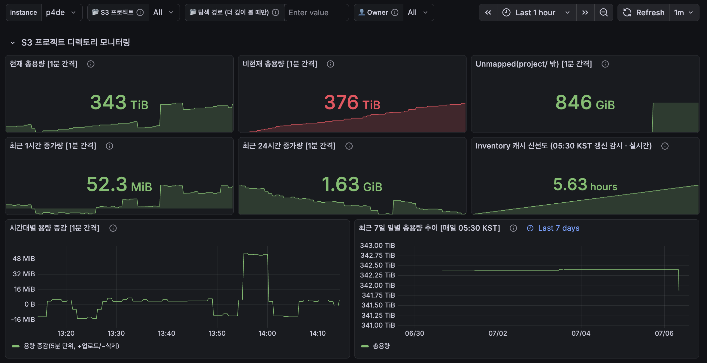
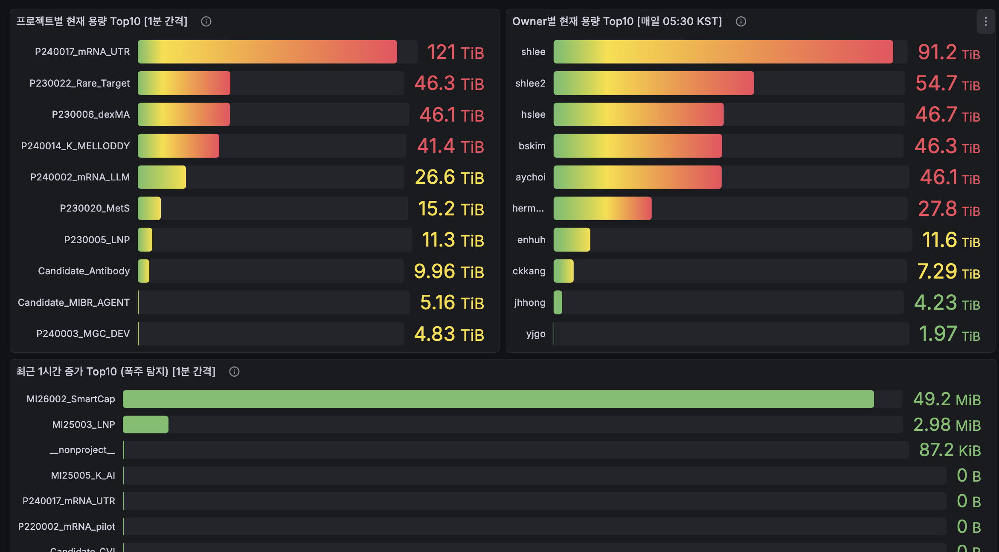
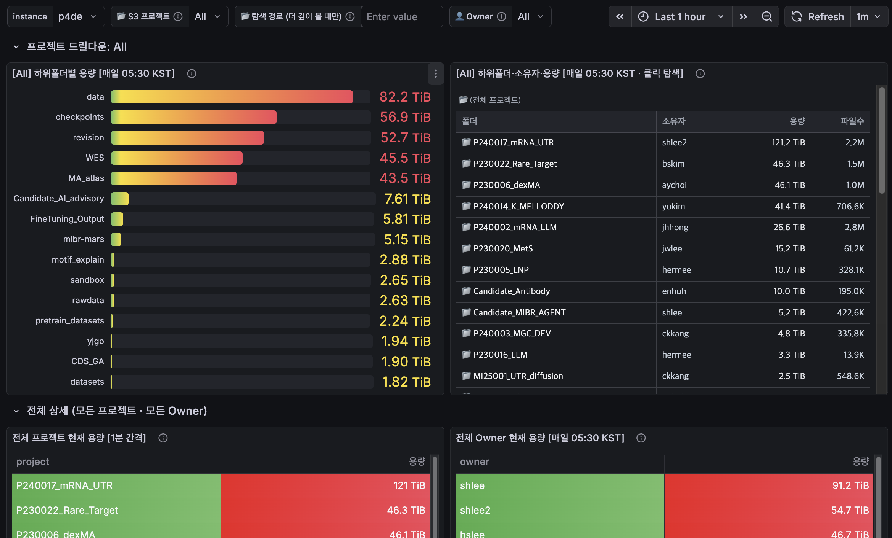

# Mogam Resource Monitoring

모니터링 시스템 전체 구성 파일

## 구조

### central/
중앙 모니터링 서버 (Prometheus + Grafana + Alertmanager + FSx Exporter)
- **위치**: monitoring 인스턴스 
- **포트**: Prometheus 9090, Grafana 3000 (ALB 80)
  - FSx Exporter: 9101
- **URL**: http://mogam-grafana-alb-2031646283.us-west-2.elb.amazonaws.com/d/adv2ww5

### central/s3-project-monitor/
S3 사용량·비용 모니터링 수집기 (독립 컨테이너, 포트 9104)
- **collector.py**: 매일 05:30 KST, S3 Inventory → Athena 집계 → Prometheus 캐시 생성 + 폴더 트리(depth 1~7) 사전계산
- **s3_project_exporter.py**: 일배치 캐시 + 실시간 카운터(DynamoDB) + 폴더 드릴다운 API(`/api/tree`) 노출
- **bootstrap_counter.py**: 실시간 카운터를 인벤토리 기준으로 재정합(매일 05:45 KST)
- **데이터 소스**: S3 Inventory(정확·하루 1번) + SQS/DynamoDB 이벤트(실시간·1분)

### exporters/
각 인스턴스의 메트릭 수집기
- **gpu-instances/**: GPU 인스턴스용 (p4d, p4de, g5, head)
  - dcgm-exporter (GPU 메트릭)
  - node-exporter (시스템 메트릭)
  - process-exporter (프로세스 메트릭)
  - gpu_exporter.py (커스텀 GPU 프로세스 추적)

## 배포

### 중앙 서버
```bash
cd central
docker compose up -d
```

### GPU 인스턴스
```bash
cd exporters/gpu-instances
docker compose up -d
```

## 데이터 보존
- Prometheus: 7일 retention
- Grafana: 영구 (볼륨)
- 백업: central/backups/

---

## Grafana 대시보드

Prometheus에서 수집된 메트릭을 Grafana로 시각화합니다. 인스턴스별(p4d, p4de, g5 등) 필터링이 가능하며 1분 주기로 자동 새로고침됩니다.

### GPU 사용자 현황


- **시스템 요약**: CPU 사용량(Used/Total 코어), Memory 사용량(GiB/TiB) 한눈에 확인
- **GPU 상태 테이블**: GPU 번호별 사용률(%), 점유 사용자, 상태(active/idle/idle_long) 표시
- **GPU 사용률 그래프**: GPU 0~7번 각각의 사용률 시계열 차트 (Last/Max 값 범례 포함)

### CPU 사용자 현황


- **사용자별 CPU 코어 사용량**: 각 사용자가 점유 중인 CPU 코어 수를 시계열로 표시
- 범례에서 Last(현재)/Max(최대) 값으로 사용자별 리소스 점유 현황 파악 가능

### FSx 사용 현황 (AWS)


- **디스크 사용량 (도넛 차트)**: 전체 FSx 볼륨의 실제 디스크 사용률 (압축 후 기준)
- **경로별 용량**: home / s3 / tmp 경로별 실시간 사용량(TiB)
- **사용자별 데이터 크기**: 소유권 기준 `/fsx` 전체에서 사용자별 저장 용량 바 차트

---

## S3 사용량·비용 모니터링

S3 스토리지 비용 최적화를 위해 프로젝트/소유자/폴더 단위 사용량을 추적합니다. 두 가지 방식으로 수집합니다.

- **정확한 값 [하루 1번]**: 매일 05:30 KST, S3 Inventory 전체 목록을 Athena로 집계
- **실시간 값 [1분]**: 파일 업로드/삭제 이벤트를 SQS로 받아 DynamoDB에 누적, 1분마다 최신 용량 반영

수집한 값은 Prometheus에 저장하고 Grafana로 시각화합니다. 화면 제목의 `[1분 간격]` / `[매일 05:30 KST]` 태그로 갱신 주기를 구분합니다.

### 개요 (총용량·증감·신선도)



- **현재/비현재 총용량**: 현재 버전과 이전 버전(non-current) 용량을 분리 표시
- **Unmapped**: `project/` 밖 데이터 용량
- **최근 1시간/24시간 증가량, 시간대별 증감**: 실시간 사용량 변화 추적
- **Inventory 캐시 신선도**: 하루 1번 집계가 정상 동작하는지 실시간 감시 (실패 시 값이 계속 증가)
- **최근 7일 추이**: 일별 총용량 변화

### 프로젝트·소유자 Top10 + 폭주 탐지



- **프로젝트별 현재 용량 Top10** [실시간·1분]
- **Owner별 현재 용량 Top10** [하루 1번] — FSx 파일 소유권 기준 매핑
- **최근 1시간 증가 Top10 (폭주 탐지)**: 급격히 늘어난 프로젝트 조기 감지

### 프로젝트 → 폴더 드릴다운



- **하위폴더별 용량** + **폴더·소유자·용량 클릭 탐색 테이블**
- 폴더를 클릭하면 하위 폴더로 계속 파고들며 용량/소유자/파일수 확인
  - depth 1~7: 사전계산 트리로 즉시 조회
  - depth 8 이상: Athena 온디맨드 조회(약 5~10초)로 모든 깊이 탐색 가능
- 상단 `S3 프로젝트`·`Owner` 셀렉트박스와 연동

## 배포 (S3 모니터)

```bash
cd central/s3-project-monitor
docker build -t s3-project-monitor .
docker run -d --name s3-project-monitor -p 9104:9104 -v /data:/data s3-project-monitor
```
